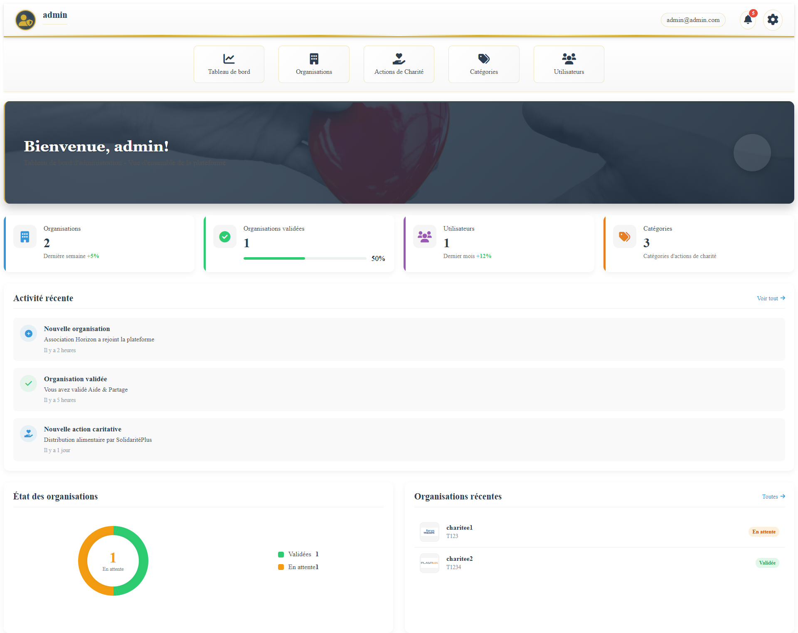

<a id="readme-top"></a>

<!-- PROJECT LOGO -->
<br />
<div align="center">
 

  <h3 align="center">CharityApp</h3>

  <p align="center">
   A comprehensive software solution designed to help charitable organizations streamline their operations. The system enables efficient management of donations, donor relationships, volunteer coordination, event planning, and project tracking. With features for financial reporting and impact visualization, it helps charities maximize their social impact while maintaining transparency with stakeholders.
  </p>
</div>

<!-- TABLE OF CONTENTS -->
<details>
  <summary>Table of Contents</summary>
  <ol>
    <li>
      <a href="#about-the-project">About The Project</a>
      <ul>
        <li><a href="#built-with">Built With</a></li>
      </ul>
    </li>
    <li><a href="#screenshots">Screenshots</a></li>
    <li>
      <a href="#getting-started">Getting Started</a>
      <ul>
        <li><a href="#prerequisites">Prerequisites</a></li>
        <li><a href="#installation">Installation</a></li>
      </ul>
    </li>
    <li><a href="#contact">Contact</a></li>
  </ol>
</details>

<!-- ABOUT THE PROJECT -->
## About The Project

<a href="https://github.com/Hamza-Alali-0/Charityproject">
    
</a>


The Charity Management System is a comprehensive application designed to streamline operations for charitable organizations. It enables you to:

- **Manage Donations**: Record and track monetary and in-kind donations with detailed information.
- **Donor Management**: Maintain donor profiles, communication history, and giving patterns.
- **Volunteer Coordination**: Register volunteers, track hours, and assign them to specific projects.
- **Event Planning**: Organize fundraising events with budget tracking and attendance management.
- **Project Tracking**: Monitor ongoing charity initiatives, allocate resources, and track impact.
- **Financial Reporting**: Generate detailed reports on donations, expenses, and fund allocation.
- **Impact Metrics**: Visualize the organization's social impact through customizable dashboards.
- **Communication Tools**: Send automated thank-you messages and maintain regular donor engagement.


### Built With

This project is built with the following technologies:
* [![Spring Boot][SpringBoot.com]][SpringBoot-url]
* [![MongoDB][MongoDB.com]][MongoDB-url]
* [![Spring Security][SpringSecurity.com]][SpringSecurity-url]
* [![Thymeleaf][Thymeleaf.com]][Thymeleaf-url]

<!-- Reference-style links for images -->
[SpringBoot.com]: https://img.shields.io/badge/Spring%20Boot-6DB33F?style=for-the-badge&logo=spring-boot&logoColor=white
[SpringBoot-url]: https://spring.io/projects/spring-boot
[MongoDB.com]: https://img.shields.io/badge/MongoDB-47A248?style=for-the-badge&logo=mongodb&logoColor=white
[MongoDB-url]: https://www.mongodb.com/
[SpringSecurity.com]: https://img.shields.io/badge/Spring%20Security-6DB33F?style=for-the-badge&logo=spring-security&logoColor=white
[SpringSecurity-url]: https://spring.io/projects/spring-security
[Thymeleaf.com]: https://img.shields.io/badge/Thymeleaf-005F0F?style=for-the-badge&logo=thymeleaf&logoColor=white
[Thymeleaf-url]: https://www.thymeleaf.org/


<p align="right">(<a href="#readme-top">back to top</a>)</p>

<!-- SCREENSHOTS -->
## Screenshots

Here are some screenshots of the project:

| ![charity Page][charity-screenshot] | ![categories Page][categories-screenshot] | ![charityview Page][charityview-screenshot] |
|-------------------------------|----------------------------------|----------------------------------|
| **charity Page**                 | **categories Page**                  | **charityview Page**                  |

<!-- Reference-style links for images -->
[charity-screenshot]: Assets/charities.png
[categories-screenshot]: Assets/categories.png
[charityview-screenshot]: Assets/charityview.png

<p align="right">(<a href="#readme-top">back to top</a>)</p>


<!-- GETTING STARTED -->
## Getting Started

To get a local copy up and running, follow these steps.

### Prerequisites

Before you begin, ensure you have the following installed:

- **Java Development Kit (JDK)**  
  - Version 11 or higher is recommended.  
  - Download it from [Oracle JDK](https://www.oracle.com/java/technologies/javase-jdk11-downloads.html) or [OpenJDK](https://openjdk.org/projects/jdk/11/).

- **Maven**  
  - Required for building the Spring Boot project.  
  - Download it from [Maven Downloads](https://maven.apache.org/download.cgi) and ensure it’s added to your system path.

- **MongoDB**  
  - Install MongoDB Community Server.  
  - Download it from [MongoDB Downloads](https://www.mongodb.com/try/download/community).  
  - Ensure MongoDB is running locally on its default port (`27017`), or configure the connection URI in your application properties.

- **IDE or Text Editor**  
  - Use an IDE like [IntelliJ IDEA](https://www.jetbrains.com/idea/), [Spring Tool Suite](https://spring.io/tools), or [Eclipse](https://www.eclipse.org/).  
  - Alternatively, use a text editor like [VS Code](https://code.visualstudio.com/) with Java support and Spring Boot extensions.


### Installation

1. **Clone the repository**
   ```sh
   git clone https://github.com/Hamza-Alali-0/charityproject.git
   cd charityproject

<a id="contact"></a>
## Contact

Hamza Alali - [hamza.alali.dev@gmail.com](mailto:hamza.alali.dev@gmail.com)


Connect with me:
- <a href="https://dev.to/@hamzaalali0" target="_blank"></a>
- <a href="https://www.linkedin.com/in/hamza--alali" target="_blank"></a>
- <a href="https://github.com/hamza-alali-0" target="_blank"></a>
- <a href="https://www.instagram.com/alalihamza.0/" target="_blank"></a>

Project Link: [https://github.com/Hamza-Alali-0/charityproject](https://github.com/Hamza-Alali-0/charityproject)

<p align="right">(<a href="#readme-top">back to top</a>)</p>
   
